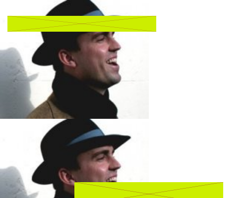

# far-canvas

## install

```bash
npm install @nextml/far-canvas
```

## motivation

For example: translated `100'000'000px` away from the center (and a scaling of 1.5) and rendering the objects that far away:

### vanilla canvas exapmle at 0px translation


### vanilla canvas example at 100Mpx translation


### far canvas example at 100Mpx translation


1. Images, rectangles and lines are all missaligned.
2. `lineWidth=8px` is not rendered correctly.

## usage
### Node
```javascript
const { far } = require("../lib.cjs/index.js");

const farAway = 100000000;
const context = far(canvas, {y: -farAway, scale: 2}).getContext("2d");

context.fillRect(32, farAway + 16, 128, 128);
...
```

### Web
```javascript
const canvas = document.getElementById('far');

const farAway = 100000000;
const context = far.far(canvas, {y: -farAway, scale: 2}).getContext("2d");

context.fillRect(32, farAway + 16, 128, 128);
...
```

## development
### run exampl
```bash
npm run example
```

### update version
```bash
npm version patch | minor | major
```
